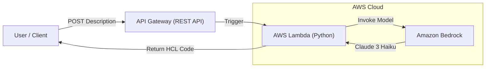

# Terraform Genie 🧞‍♂️

> **Serverless Text-to-Infrastructure Generator using AWS Bedrock & Claude 3 Haiku.**

Terraform Genie is a serverless API that accepts natural language descriptions of infrastructure (e.g., *"I need a secure S3 bucket with versioning"*) and instantly generates valid, production-ready Terraform HCL code.

It demonstrates how to build **Generative AI** applications on AWS while adhering to strict **Security**, **Cost Optimization**, and **Infrastructure as Code** best practices.


## 🏗 Architecture

The solution uses a completely serverless stack to ensure zero idle costs.



## 🚀 Features

* **Natural Language to Code:** Converts simple English into complex Terraform configurations.
* **Cost-Effective:** Uses **Claude 3 Haiku** (cheaper than GPT-4) and Serverless compute. Estimated cost is <$0.01 per 100 requests.
* **Secure by Default:**
* **API Authentication:** Requires a valid API Key for all requests.
* **Throttling:** Limits usage to 100 requests/day to prevent billing spikes.
* **Input Validation:** Sanitizes inputs to prevent prompt injection.


## 🛠 Prerequisites

1. **AWS Account** with active billing.
2. **Terraform installed** (v1.0+).
3. **Amazon Bedrock Model Access:**
* Go to **AWS Console > Amazon Bedrock > Model access**.
* Request access for **Anthropic -> Claude 3 Haiku**.

## 📂 Project Structure

```text
terraform-genie/
├── app/
│   └── main.py          # Lambda function logic (Python)
├── infra/
│   ├── main.tf          # Terraform resources (Lambda, API Gateway, IAM)
│   ├── providers.tf     # AWS provider configuration
│   └── outputs.tf       # Outputs API Endpoint & Key
├── test_genie.py        # Client script to test the API securely
├── .gitignore           # Ignores sensitive state files and secrets
└── README.md            # Documentation

```


## 📦 Deployment Guide

This project uses Terraform to deploy the entire stack (Lambda, API Gateway, IAM Roles).

1. **Clone the Repository:**
```bash
git clone https://github.com/rojansedhai/terraform-genie.git
cd terraform-genie/infra

```


2. **Initialize Terraform:**
```bash
terraform init

```


3. **Deploy:**
```bash
terraform apply

```


*Type `yes` when prompted.*

4. **Get Your Credentials:**
After deployment, Terraform will output your API URL and your Secret Key.
```bash
terraform output api_endpoint
terraform output -raw api_key

```


*(Save these! You will need them to test the tool).*

## ⚡ Usage

You can test the API using `curl` or Python. You **must** include the `x-api-key` header.

### Option 1: Using curl (Linux/Mac)

```bash
curl -X POST https://YOUR-API-ID.execute-api.us-east-1.amazonaws.com/prod/generate \
  -H "Content-Type: application/json" \
  -H "x-api-key: PASTE_YOUR_KEY_HERE" \
  -d '{"description": "A secure S3 bucket with versioning"}'

```

### Option 2: Using Python (Recommended)

This method is safer as it uses environment variables instead of hardcoding secrets.

1. **Export your API Key:**
```bash
# Linux/Mac
export GENIE_API_KEY="your_terraform_output_key_here"

# Windows (PowerShell)
$env:GENIE_API_KEY="your_terraform_output_key_here"

```


2. **Run the provided test script:**
Update the `API_URL` variable in `test_genie.py` with your endpoint from the deployment step, then run:
```bash
python3 test_genie.py

```


**Example Output:**
```text
✅ SUCCESS! Here is your Terraform Code:
------------------------------------------------
resource "aws_s3_bucket" "secure_bucket" {
  bucket = "my-secure-bucket-123"
  # ...
}
------------------------------------------------

```


## 🛡 Security & Best Practices

This project implements several key security measures:

* **Least Privilege IAM:** The Lambda function is only allowed to invoke the specific Claude 3 Haiku model (`anthropic.claude-3-haiku-20240307-v1:0`), minimizing the blast radius.
* **API Key Authentication:** The API Gateway rejects any request without a valid `x-api-key` header.
* **Rate Limiting:** A usage plan limits the API to **100 requests per day** and **2 requests per second** to prevent cost overruns.
* **Input Sanitization:** The Python application validates input using a regex allowlist (`^[a-zA-Z0-9\s.,?-_]*$`) to prevent prompt injection or malicious payloads.
* **Environment Variables:** The client script uses `os.getenv` to avoid hardcoding secrets in source control.

## 🧹 Clean Up

To avoid incurring future costs (even though they are minimal), destroy the infrastructure when you are done testing.

```bash
cd infra
terraform destroy

```

*Type `yes` to confirm deletion.*

## 📄 License

This project is licensed under the MIT License.

---

*Built with ❤️ by [Rojan Sedhai*](https://www.google.com/search?q=https://github.com/rojansedhai)

```