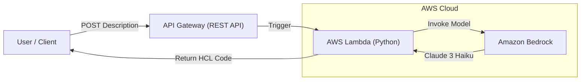

# Terraform Genie 🧞‍♂️

> **Serverless Text-to-Infrastructure Generator using AWS Bedrock & Claude 3 Haiku.**

Terraform Genie is a serverless API that accepts natural language descriptions of infrastructure (e.g., *"I need a secure S3 bucket with versioning"*) and instantly generates valid, production-ready Terraform HCL code.

It demonstrates how to build **Generative AI** applications on AWS while adhering to strict **Security**, **Cost Optimization**, and **Infrastructure as Code** best practices.


## 🏗 Architecture

The solution uses a completely serverless stack to ensure zero idle costs.



## 🚀 Features

* **Natural Language to Code:** Converts simple English into complex Terraform configurations.
* **Cost-Effective:** Uses **Claude 3 Haiku** (cheaper than GPT-4) and Serverless compute. Estimated cost is <$0.01 per 100 requests.
* **Secure by Default:**
    * **API Authentication:** Requires a valid API Key for all requests.
    * **Throttling:** Limits usage to 100 requests/day to prevent billing spikes.
    * **Input Validation:** Sanitizes inputs to prevent prompt injection.

## 🛠 Prerequisites

1.  **AWS Account** with active billing.
2.  **Terraform installed** (v1.0+).
3.  **Amazon Bedrock Model Access:**
    * Go to **AWS Console > Amazon Bedrock > Model access**.
    * Request access for **Anthropic -> Claude 3 Haiku**.

## 📦 Deployment Guide

This project uses Terraform to deploy the entire stack (Lambda, API Gateway, IAM Roles).

1.  **Clone the Repository:**
    ```bash
    git clone [https://github.com/rojansedhai/terraform-genie.git](https://github.com/rojansedhai/terraform-genie.git)
    cd terraform-genie/infra
    ```

2.  **Initialize Terraform:**
    ```bash
    terraform init
    ```

3.  **Deploy:**
    ```bash
    terraform apply
    ```
    *Type `yes` when prompted.*

4.  **Get Your Credentials:**
    After deployment, Terraform will output your API URL and your Secret Key.
    ```bash
    terraform output api_endpoint
    terraform output -raw api_key
    ```
    *(Save these! You will need them to test the tool).*

## ⚡ Usage

You can test the API using `curl` or Python. You **must** include the `x-api-key` header.

### Option 1: Using curl (Linux/Mac)
```bash
curl -X POST [https://YOUR-API-ID.execute-api.us-east-1.amazonaws.com/prod/generate](https://YOUR-API-ID.execute-api.us-east-1.amazonaws.com/prod/generate) \
  -H "Content-Type: application/json" \
  -H "x-api-key: PASTE_YOUR_KEY_HERE" \
  -d '{"description": "A secure S3 bucket with versioning"}'